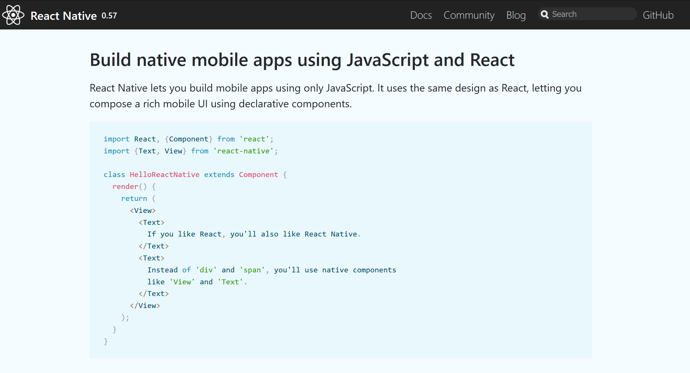

export theme from './theme';
import { Appear } from 'mdx-deck';
import { Split } from 'mdx-deck/layouts';

# Please download `Expo` from the app store if you wanna see demos up close


_Not sponsered by Expo I swear_

```notes
You can play with a couple demos on your phone if you download this app
```

---

# Building True Native Mobile Applications in JavaScript

```notes
- Introduction
- Hands up web Development
- Heard of react native
- True native tease
```

---

export default Split;


### Things I do

-   React
-   VueJS
-   React Native
-   NodeJS

### Things I like

-   Coffee
-   Talking
-   Overcommiting

```notes
- Twitter
- React Native developer for 2 years


- I like coffee
- I like talking hence this
- I like overcommiting hence doing this the week I have 2 coursework deadlines
```

---

## What is React Native?

From the Docs - `https://facebook.github.io/react-native/`



```notes
React Native lets you build mobile apps using only JavaScript.

- Cross platform - FLOW INTO REACT BY MENTIONING REACT.RENDER
- React paradigm - FLOW INTO JAVASCRIPT BY SAYING REACT IS JUST JS
- JavaScript - JAVASCRIPT TO NATIVE BY TALKING ABOUT THE BRIDGE (A BIT)
- Native components
```

---

## What is React Native not?

<Appear>
    
</Appear>

```notes
Misconception about what React Native is

- Android and iOS are not the same
- It is a flaw in the cross platform approach
- Still better than the alternative from a business point of view
```

---

## What does React Native give you?

-   Cross platform applications
-   ~95% code sharing
-   Native components
-   Hot Reloading
-   Familiar UI layout system
-   Great community support

```notes
- Cross platform applications (not just mobile, tease for later
- Code sharing figure is from my work with it at both Fluid and my own person project
- Native components (explain bridge JSON serialization)
- Hot reloading (so long as you're changing just something in JavaScript land it works)
- UI layout system with flexbox which is really intuitive imo
- Community really on it with companies built around it etc
```

---

## The Developer Experience

### _BRN: Before React Native..._

-   Multiple codebases
-   Multiple skillsets
-   Multiple tools
-   Multiple departments

### _and..._

```notes
If you want a native app for both platforms you need(ed) these things

If you decide that just android or just ios is good enough you can get this...
```

---


```notes
Seems a bit ridiculous but some people are really passionate about apps on their phone and love complaining
```

---

## The Developer Experience

### _ARN: After React Native..._

-   One codebase
-   One reusable skillset
-   Editor of choice (it's just JavaScript)
-   One team across multiple platforms

[Why stop at two platforms?](https://github.com/SaraVieira/awesome-react-platforms)

```notes
So what's the world like now the second coming of mobile development has come around...

- I was the only React Native developer at Fluid for months

- I use VSCode it's decent React Native support and Microsoft in general are supporting RN with app center and their own fork ReactXP
```

---

# Code Demo

[https://codesandbox.io/s/6ljq7jpqjk](https://codesandbox.io/s/6ljq7jpqjk)

[https://snack.expo.io/@joefazz/gdg_clock](https://snack.expo.io/@joefazz/gdg_clock)

```notes

- Discuss what it is (React not RN)
- Show first page, import of Clock component
- Root element
- ReactDOM.render()


- Second page CLOCK.JS
- ClockDisplay component import
- ES6 class for stateful components extends _React.Component_
- Side effects explanation
- Render description

- DISPLAY.JS
- Functional component same as the index.js one
- Stateless
- Don't have to worry about this which is funky in JS

EXPLAIN WHY IT ISN'T WORKING

TRY SET ALARM (explain why that re renders the time and why you don't see the alarm)

FIX CODE

CELEBRATE

ANY QUESTIONS?

SHOW REACT NATIVE VERSION

SHOW DIFFERENCES
```

---

## React vs. React Native

```jsx
(props) => (
    <div className="hello-wrapper">
        
        <span style={{ color: 'yellow' }}>This is React</span>
    </div>
);
```

<div
    style={{
        backgroundColor: 'black',
        display: 'flex',
        flexDirection: 'column',
        alignItems: 'center'
    }}
>
    
    <span style={{ color: 'yellow' }}>This is React</span>
</div>

```notes
Should now be about half way through. CHECK TIME

- Discuss differences between React and HTML

- ClassName instead of class (although class does work)

- Style attribute

- Functional with props
```

---

## React vs. React Native

```jsx
(props) => (
    <View style={styles.helloWrapper}>
        <Image
            source={{ uri: 'https://facebook.github.io/react-native/img/header_logo.png' }}
            width={100}
        />
        <Text style={{ color: 'yellow' }}>This is React Native</Text>
    </View>
);
```

<div
    style={{
        backgroundColor: 'black',
        display: 'flex',
        flexDirection: 'column',
        alignItems: 'center'
    }}
>
    
    <span style={{ color: 'yellow' }}>This is React Native</span>
</div>

```notes
Same functional component

- View instead of div
- Image instead of img
- Text instead of span

- Style attribute differences
- source uri thing (annoying YOU WILL FORGET THIS)

Render shown below (although I cheated this time)
```

---

## React Native Misconceptions

-   Navigation is bad
-   Every release is a breaking change
-   You still can't make a real native UI

```notes
If you've heard of react native before or search online for naysayers you will of heard these things

- Navigation is bad. It's not anymore react-navigation is really good and wix navigation is also good (but I've not tried it)
- Every release is a breaking change (this stopped around version 0.50)
- Still can't make a real native UI because at the end of the day it's still an abstraction
```

---

## Myth


```notes
Introduce game

2 screenshots
```

---

export default Split;


---

export default Split;


```notes
Results of game

Brief mention about Airbnb ditching React Native but when the screenshot was taken there was RN code in there
```

---

## Getting Started x2

```bash
# React Native CLI

$   yarn global add react-native-cli
```

```bash
# Expo CLI

$   yarn global add expo-cli
```

```notes
mention brownfield option but it's not recommended (by me)
```

---

## Vanilla React Native

```bash
$   react-native init myproject
```

**47.65 seconds later...**

```bash
To run your app on iOS:
    cd /Users/joefazzino/myproject
    react-native run-ios
    - or -
    Open ios/myproject.xcodeproj in Xcode
    Hit the Run button
To run the app on Android:
    cd /Users/joefazzino/myproject
    Have an Android emulator running (quickest way to get started)
    or a device connected
    react-native run-android
```

---

## Expo Flavour

```bash
$   expo init myproject
? Choose a template: expo-template-blank
? Yarn v1.13.0 found. Use Yarn to install dependencies? Yes
```

**109.21 seconds later...**

```bash
Your project is ready at /Users/joefazzino/myproject
To get started, you can type:

    cd myproject
    yarn start
```

```notes
The point of this is not to show you how fast my processor is

It's just to show you that you're getting more boilerplate with expo
```

---

# A clock is cute but show me the money £££

---

# More Code

[https://snack.expo.io/@joefazz/swiper](https://snack.expo.io/@joefazz/swiper)

```notes
Movie api side effects (don't steal my api key please)

saving the results to state

has swiped listener

mapping to react components

keys and indecies

panresponders are used for listening to interaction

animated is used to perform native animations

constructor state declaration with anaimated value

walk through pan responder code

interpolation

rendering apply panhandlers

transform
```

---

# Summary

## React Native is...

-   JavaScript
-   React
-   Native
-   Cross Platform

<Appear>
    <h2> 🔥 Lit 🔥 </h2>
</Appear>

```notes
Read the slide bro

REMEMBER THAT IT'S LIT  🔥
```

---

# 🎉 Thank you 🎉

### Some learning resources

-   [React.js Conf 2015 Keynote - Introducing React Native](https://www.youtube.com/watch?v=KVZ-P-ZI6W4)
-   [25 React Native Tutorials](https://codeburst.io/25-react-native-tutorials-5b613e3f46ac)
-   [Harvard CS50 Mobile App Development](https://cs50.github.io/mobile/lectures)

#### Twitter: `@purefazz`

#### Github: `joefazz`

#### Blog: `joefazzino.me`

#### Email: `joseph@fazzino.net`

### Please hire me ✌️
